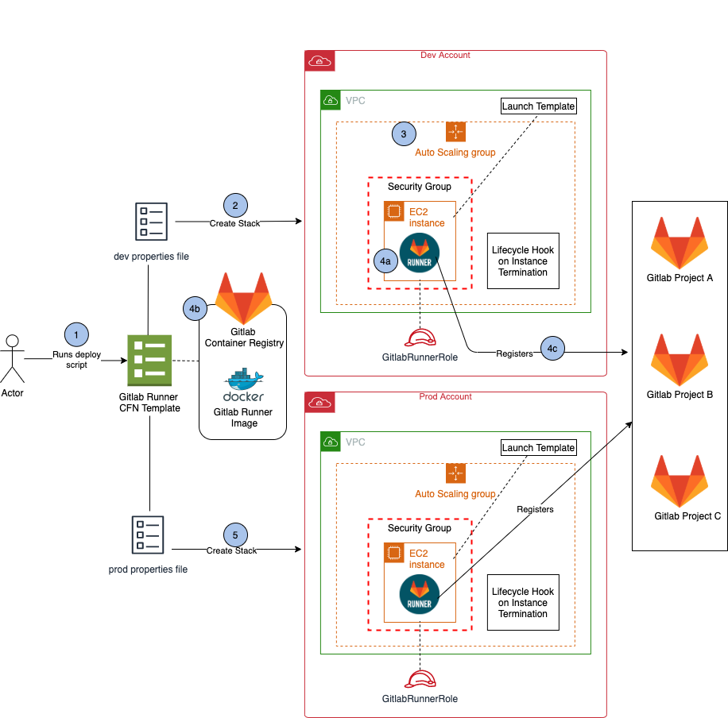
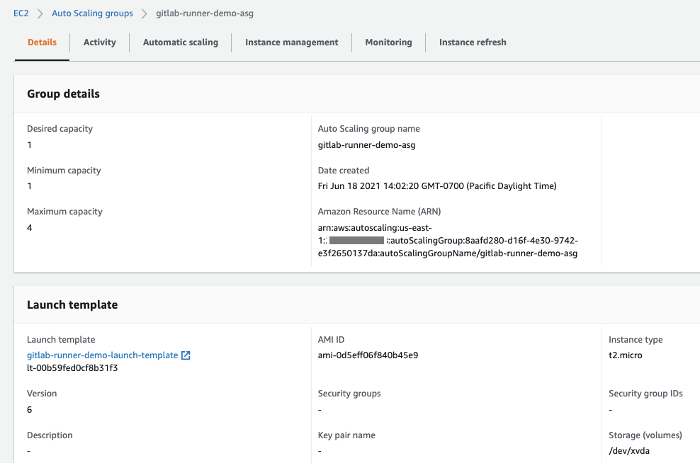
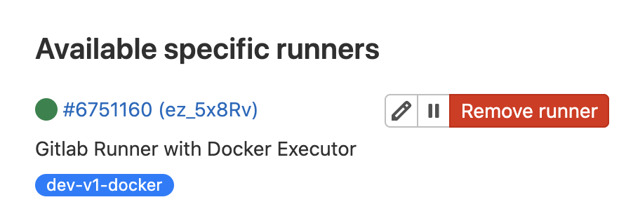
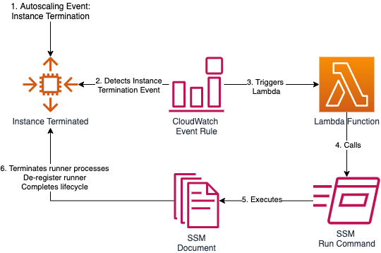
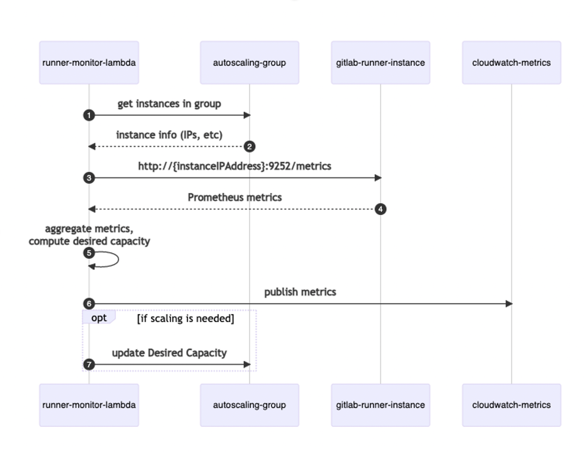
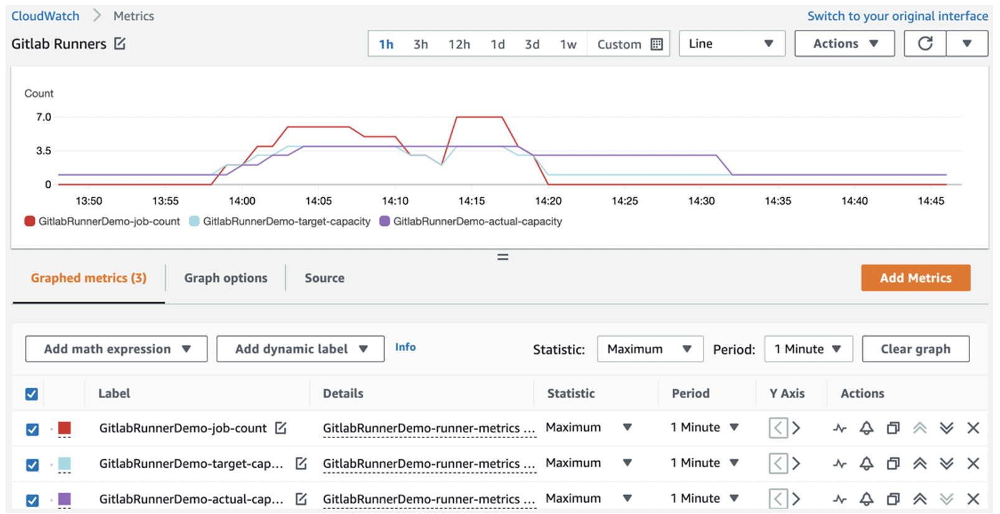

# Deploy and Manage Gitlab Runners on Amazon EC2

This solution automates Gitlab Runner deployment and administrative tasks on Amazon EC2 through Infrastructure-as-Code (IaC).

The solution is published in this [blog post](https://aws.amazon.com/blogs/devops/deploy-and-manage-gitlab-runners-on-amazon-ec2/). 

> NOTE: The solution presented in this post illustrates a possible way of implementing Gitlab runner autoscaling. Support for this solution is limited. A vendor supported solution is available here: [GitLab HA Scaling Runner Vending Machine for AWS EC2 ASG](https://gitlab.com/guided-explorations/aws/gitlab-runner-autoscaling-aws-asg). 
As a result of this [breaking change](https://gitlab.com/gitlab-org/gitlab/-/issues/380872), the solution's token registration process has been be updated on 04/22/2024. The previsou code has been tagged as v1.0. 

## Overview of the solution
The following diagram displays the solution architecture. It also shows the workflow of deploying the Gitlab Runner and registering it to Gitlab projects. 


1.	We use AWS CloudFormation to describe the infrastructure that is hosting the Gitlab Runner. The user runs a deploy script in order to deploy the CloudFormation template. The template is parameterized, and the parameters are defined in a properties file. The properties file specifies the infrastructure configuration, as well as the environment in which to deploy the template. 

2.	The deploy script calls CloudFormation CreateStack API to create a Gitlab Runner stack in the specified environment.

3.	During stack creation, an EC2 autoscaling group is created with the desired number of EC2 instances. Each instance is launched via a launch template, which is created with values from the properties file. An IAM role is created and attached to the EC2 instance. The role contains permissions required for the Gitlab Runner to execute pipeline jobs. A lifecycle hook is attached to the autoscaling group on instance termination events. This ensures graceful instance termination. 

4.	During instance launch, CloudFormation uses a cfn-init helper script to install and configure the Gitlab Runner:

    - (4a) cfn-init installs the Gitlab Runner software on the EC2 instance. 
    - (4b) cfn-init configures the Gitlab Runner as a docker executor using a pre-defined docker image in the Gitlab Container Registry. The docker executor implementation lets the Gitlab Runner run each build in a separate and isolated container. The docker image contains the software required to run the pipeline workloads, thereby eliminating the need to install these packages during each build. 
    - (4c) cfn-init registers the Gitlab Runner to Gitlab projects specified in the properties file, so that these projects can utilize the Gitlab Runner to run pipelines. 

5.	The user may repeat the same steps to deploy Gitlab Runner into another environment. 

## Prerequisites
For this walkthrough, you need the following: 
- A Gitlab account (all tiers including Gitlab Free self-managed, Gitlab Free SaaS, and higher tiers). This demo uses gitlab.com free tier. 
- A Gitlab Container Registry. 
- A [Git client](https://git-scm.com/downloads) to clone the source code provided.
- An AWS account with local credentials properly configured (typically under ~/.aws/credentials) with these permissions:
    - AmazonEC2FullAccess
    - AutoScalingFullAccess
    - AmazonS3FullAccess
    - AmazonSSMFullAccess
    - AmazonEventBridgeFullAccess
    - AWSCloudFormationFullAccess
    - AWSLambda_FullAccess
    - IAMFullAccess
    - AmazonECS_FullAccess
    - AmazonEC2ContainerRegistryPowerUser
- The latest version of the AWS CLI. For more information, see [Installing, updating, and uninstalling the AWS CLI](https://docs.aws.amazon.com/cli/latest/userguide/cli-chap-install.html).
- Docker is installed and running on the localhost/laptop.
- Nodejs and npm installed on the localhost/laptop. 
- A VPC with 2 private subnets and that is connected to the internet via NAT gateway allowing outbound traffic.  
- The following IAM service-linked role created in the AWS account: AWSServiceRoleForAutoScaling
- An S3 bucket for storing Lambda deployment packages. 
- Familiarity with Git, Gitlab CI/CD, Docker, EC2, and CloudFormation.

## Build a docker executor image for the Gitlab Runner
The Gitlab Runner in this solution is implemented as docker executor. The Docker executor connects to Docker Engine and runs each build in a separate and isolated container via a predefined docker image. The first step in deploying the Gitlab Runner is building a docker executor image. We provided a simple Dockerfile in order to build this image. You may customize the Dockerfile to install your own requirements. 

### To build a docker image using the sample Dockerfile: 
1.	Create a directory where we will store our demo code. From your terminal run:
```
mkdir demo-repos && cd demo-repos
```
2.	Clone the source code repository found in the following location:
```
git clone <URL_OF_THIS_REPO>
```
3.	Create a new project on your Gitlab server. Name the project any name you like. 
4.	Clone your newly created repo to your laptop. Ignore the warning about cloning an empty repository.
```
git clone <URL_OF_YOUR_REPO>
```
5.	Copy the demo repo files into your newly created repo on your laptop, and push it to your Gitlab repository. You may customize the Dockerfile before pushing it to Gitlab. 
```
cp -r amazon-ec2-gitlab-runner/* <your-repo-dir>
cd <your-repo-dir>
git add .
git commit -m “Initial commit”
git push
```
6.	On the Gitlab console, go to your repository’s Package & Registries -> Container Registry. Follow the instructions provided on the Container Registry page in order to build and push a docker image to your repository’s container registry. 

## Deploy the Gitlab Runner stack
Once the docker executor image has been pushed to the Gitlab Container Registry, we can deploy the Gitlab Runner. The Gitlab Runner infrastructure is described in the Cloudformation template gitlab-runner.yaml. Its configuration is stored in a properties file called sample-runner.properties. A launch template is created with the values in the properties file. Then it is used to launch instances. This architecture lets you deploy Gitlab Runner to as many environments as you like by utilizing the configurations provided in the appropriate properties files.

### To deploy the Gitlab Runner stack:
1.	Obtain the runner registration tokens of the Gitlab projects that you want registered to the Gitlab Runner. Obtain the token by selecting the project’s Settings > CI/CD and expand the Runners section. 
2.	Update the sample-runner.properties file parameters according to your own environment. Refer to the gitlab-runner.yaml file for a description of these parameters. Rename the file if you like. You may also create an additional properties file for deploying into other environments. 
3.	Run the deploy script to deploy the runner: 
```
cd <your-repo-dir>
./deploy-runner.sh <properties-file> <region> <aws-profile> <stack-name> 

<properties-file> is the name of the properties file. 
<region> is the region where you want to deploy the stack. 
<aws-profile> is the name of the CLI profile you set up in the prerequisites section. 
<stack-name> is the name you chose for the CloudFormation stack. 
```
For example: 
```
./deploy-runner.sh sample-runner.properties us-east-1 dev gitlab-runner-demo
```

After the stack is deployed successfully, you will see the Gitlab Runner autoscaling group created in the EC2 console. 



Now go to your Gitlab project Settings->CICD->Runners->Available specific runners, you will see the fully configured Gitlab Runner. The green circle indicates that the Gitlab Runner is ready for use. 



## Updating the Gitlab Runner
There are times when you would want to update the Gitlab Runner. For example, updating the instance VolumeSize in order to resolve a disk space issue, or updating the AMI ID when a new AMI becomes available.  
Utilizing the properties file and launch template makes it easy to update the Gitlab Runner. Simply update the Gitlab Runner configuration parameters in the properties file. Then, run the deploy script to udpate the Gitlab Runner stack.

Below is an example of updating the Gitlab Runner instance type.  

### To update the instance type of the runner instance: 
1.	Update the “InstanceType” parameter in the properties file. 
```
InstanceType=t2.medium
```
2.	Run the deploy-runner.sh script to update the CloudFormation stack:
```
cd <your-repo-dir>
./deploy-runner.sh <properties-file> <region> <aws-profile> <stack-name> 
```

## Terminate the Gitlab Runner
There are times when an autoscaling group instance must be terminated. For example, during an autoscaling scale-in event, or when the instance is being replaced by a new instance during a stack update, as seen previously. When terminating an instance, you must ensure that the Gitlab Runner finishes executing any running jobs before the instance is terminated, otherwise your environment could be left in an inconsistent state. Also, we want to ensure that the terminated Gitlab Runner is removed from the Gitlab project. We utilize an autoscaling lifecycle hook to achieve these goals.  



The lifecycle hook works like this: A CloudWatch event rule actively listens for the EC2 Instance-terminate events. When one is detected, the event rule triggers a Lambda function. The Lambda function calls SSM Run Command to run a series of commands on the EC2 instances, via a SSM Document. The commands include stopping the Gitlab Runner gracefully when all running jobs are finished, de-registering the runner from Gitlab projects, and signaling the autoscaling group to terminate the instance.  

There are also times when you want to terminate an instance manually. For example, when an instance is suspected to not be functioning properly. To terminate an instance from the Gitlab Runner autoscaling group, use the following command:

```
aws autoscaling terminate-instance-in-auto-scaling-group \
    --instance-id="${InstanceId}" \
    --no-should-decrement-desired-capacity \
    --region="${region}" \
    --profile="${profile}"
```
The above command terminates the instance. The lifecycle hook ensures that the cleanup steps are conducted properly, and the autoscaling group launches another new instance to replace the old one.  

Note that if you terminate the instance by using the "ec2 terminate-instance" command, then the autoscaling lifecycle hook actions will not be triggered.

## Add/Remove Gitlab projects from the Gitlab Runner 
As new projects are added to your enterprise, you may want to register them to the Gitlab Runner, so that those projects can utilize the Gitlab Runner to run pipelines. On the other hand, you would want to remove the Gitlab Runner from a project if it no longer wants to utilize the Gitlab Runner, or if it qualifies to utilize the Gitlab Runner. For example, if a project is no longer allowed to deploy to an environment configured by the Gitlab Runner. Our architecture offers a simple way to add and remove projects from the Gitlab Runner. To add new projects to the Gitlab Runner, update the RunnerRegistrationTokens parameter in the properties file, and then rerun the deploy script to update the Gitlab Runner stack. 

### To add new projects to the Gitlab Runner:
1.	Update the RunnerRegistrationTokens parameter in the properties file. For example: 
```
RunnerRegistrationTokens=ps8RjBSruy1sdRdP2nZX,XbtZNv4yxysbYhqvjEkC
```
2.	Update the Gitlab Runner stack. This updates the SSM parameter which stores the tokens. 
```
cd <your-repo-dir>
./deploy-runner.sh <properties-file> <region> <aws-profile> <stack-name> 
```
3.	Relaunch the instances in the Gitlab Runner autoscaling group. The new instances will use the new RunnerRegistrationTokens value. Run the following command to relaunch the instances:
```
./cycle-runner.sh <runner-autoscaling-group-name> <region> <optional-aws-profile>
```
To remove projects from the Gitlab Runner, follow the steps described above, with just one difference. Instead of adding new tokens to the RunnerRegistrationTokens parameter, remove the token(s) of the project that you want to dissociate from the runner.  

## Autoscale the runner based on custom performance metrics
Each Gitlab Runner can be configured to handle a fixed number of [concurrent jobs](https://docs.gitlab.com/runner/configuration/advanced-configuration.html). Once this capacity is reached for every runner, any new jobs will be in a Queued/Waiting status until the current jobs complete, which would be a poor experience for our team. Setting the number of concurrent jobs too high on our runners would also result in a poor experience, because all jobs leverage the same CPU, memory, and storage in order to conduct the builds.

In this solution, we utilize a scheduled Lambda function that runs every minute in order to inspect the number of jobs running on every runner, leveraging the [Prometheus Metrics](https://docs.gitlab.com/ee/administration/monitoring/prometheus/gitlab_metrics.html#gitlab-prometheus-metrics) endpoint that the runners expose. If we approach the concurrent build limit of the group, then we increase the Autoscaling Group size so that it can take on more work. As the number of concurrent jobs decreases, then the scheduled Lambda function will scale the Autoscaling Group back in an effort to minimize cost. The Scaling-Up operation will ignore the Autoscaling Group’s cooldown period, which will help ensure that our team is not waiting on a new instance, whereas the Scale-Down operation will obey the group’s cooldown period.

Here is the logical sequence diagram for the work:



For operational monitoring, the Lambda function also publishes custom CloudWatch Metrics for the count of active jobs, along with the target and actual capacities of the Autoscaling group. We can utilize this information to validate that the system is working properly and determine if we need to modify any of our autoscaling parameters.



## Troubleshooting
Problem: I deployed the CloudFormation template, but no runner is listed in my repository. 

Possible Cause: Errors have been encountered during cfn-init, causing runner registration to fail. Connect to your runner EC2 instance, and check /var/log/cfn-*.log files. 

# Security

See [CONTRIBUTING](CONTRIBUTING.md#security-issue-notifications) for more information.

# License

This library is licensed under the MIT-0 License. See the LICENSE file.

